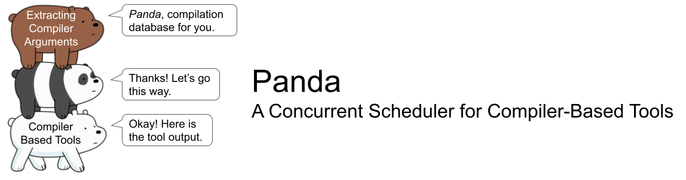

## From Compilation Database to Compiler-Based Tools.

*Panda* is a compilation-independent scheduler
for pipelining compiler-based tools in parallel
based on the [JSON compilation database][link-cdb].
It allows you to execute various tools
on translation units by replaying the compilation process.
An introduction video to this tool is available from <https://youtu.be/YQTg5LsId5k>.

The advantage of *Panda* include:

1. Compatible to customize executions of various Compiler-Based Tools
2. Avoiding interference with the build system;
3. Scheduling tool execution in a dependency-free manner
    to take full advantages of the system resources.

## Installation

*Panda* is a standalone Python script.
You can install it by directly downloading file `panda` from this repo.

```
$ curl -fsSL https://github.com/Snape3058/panda/raw/demo/panda | sudo tee /usr/bin/panda >/dev/null
$ sudo chmod +x /usr/bin/panda
```

Please note that the content on the `demo` branch is ahead of the main branch,
and only the code on this branch is for demonstration track revision.
And the functionalities on this branch will be merged to the main branch
after this tool paper gets accepted.

## Usage

Scheduling the execution of compiler-based tools requires the JSON Compilation Database.
Users can setup the environment according to the introduction from Clang
(<https://clang.llvm.org/docs/HowToSetupToolingForLLVM.html>)
or using tools like [Bear (Build EAR)][link-bear].

Execution of *Panda* requires
the *CBT Execution Configurations* (Section 2.2) to be scheduled,
as well as optional settings,
such as number of parallel workers and output path.

```
$ panda <configurations> [-f CDB] [-j JOBS] [-o OUTPUT] [options]
```

*Panda* provides built-in configurations that cover most scenes
of executing analyzers and generating desired inputs for analyzers.
The built-in configurations can be categorized as
Integrated Tool Configurations,
Singleton Tool Configurations,
and Compilation Database Configurations.
The first two categories have been mentioned in the paper,
and the last category of configurations are used to
generate output directly from the compilation database.

* Example 1: Generating external function map and invocation list
    to path `/tmp/csa-ctu-scan` under a concurrency of 16 processes.

```
$ panda -YM -j 16 -o /tmp/csa-ctu-scan
```

* Example 2: Executing a customized plugin description `/tmp/check/plugin.json`
    and store output to path `/tmp/check` sequentially.

```
$ panda --plugin /tmp/check/plugin.json -o /tmp/check
```

### Built-in Compilation Database Configurations

The compilation database configurations
transform the input compilation database
to generate the output file,
or summarize the output of other builtin configurations for Singleton tools.

* Generate *input file list* (`-L` or `--gen-input-file-list`):
    a list of all unique `file`s with absolute path.
* Generate *source file list* (`-F` or `--gen-source-file-list`):
    a list of all unique source files and the header files included.
* Generate *invocation list* (`-Y` or `--gen-invocation-list`)
    for Cross Translation Unit Analysis of the *Clang Static Analyzer*
    under [on-demand-parsing][link-odp] strategy.
* Generate *external function map* (`-M` or `--gen-extdef-mapping`)
    for Cross Translation Unit Analysis of the *Clang Static Analyzer*
    under [on-demand-parsing][link-odp] strategy.
* Generate *external function map* (`-P` or `--gen-extdef-mapping-ast`)
    for Cross Translation Unit Analysis of the *Clang Static Analyzer*
    under [AST-loading][link-al] strategy.

### Built-in Integrated Tool Configurations

The Configurations for integrated tools
mainly generate inputs in desired formats for different analyzers.

* Test command line arguments and source file syntax (`-X` or `--syntax`):
    invoke compiler with `-fsyntax-only -Wall`
* Re-compile the source file (`-C` or `--compile`):
    invoke compiler with `-c`
* Generate preprocessed source file dump (`-E` or `--preprocess`):
    invoke compiler with `-E`
* Generate Clang PCH format AST dump (`-A` or `--gen-ast`):
    invoke the clang compiler with `-emit-ast`
* Generate LLVM Bitcode in binary format (`-B` or `--gen-bc`):
    invoke the clang compiler with `-emit-llvm`
* Generate LLVM Bitcode in text cormat (`-R` or `--gen-ll`):
    invoke the clang compiler with `-emit-llvm -S`
* Generate assembly dump (`-S` or `--gen-asm`):
    invoke compiler with `-S`
* Generate dependency description dump (`-D` or `--gen-dep`):
    invoke compiler with `-M`
* Execute Clang Static Analyzer without Cross Translation Unit Analysis (`--analysis`)

### Built-in Singleton Tool Configurations

The builtin configurations for Singleton tools mainly invoke Clang Tooling based tools.

* Generating external function map (as mentioned above)

### Plugins

Users can execute customized Integrated and Singleton tools
with plugins defined with a CBT execution configuration in JSON format.
In the description,
field `comment` is a string for commenting the description,
field `type` determines the type of the configuration,
and object `action` defines the CBT Execution Configuration object.

* Example configuration (Figure 4a) of generating LLVM-IR code dumps.

```json
{
    "comment": "Example plugin for Panda scheduler.",
    "type": "Integrated",
    "action": {
        "prompt": "Generating LLVM-IR code",
        "tool": {
            "c": "clang",
            "c++": "clang++"
        },
        "args": ["-c", "-emit-llvm", "-S"],
        "extension": ".ll"
    }
}
```

For a configuration for Integrated tools, object `action` has four fields.
Field `prompt` defines the prompt string printed during executing the tool.
Field `args` is a list of command line arguments to be added during execution.
Field `extension` determines the extension name of the output file.

* Example configuration (Figure 4b) of executing Clang Query
  to identify all `goto` statements,
  and storing command line output of stdout stream to output file.

```json
{
    "comment": "Example plugin for Panda scheduler",
    "type": "Singleton",
    "action": {
        "prompt": "Match 'goto' statement",
        "tool": "clang-query",
        "args": ["-c", "match gotoStmt()"],
        "extension": ".clang-query",
        "source": "stdout"
    }
}
```

For a configuration for Singleton tools, object `action` has five fields.
Field `prompt`, `args`, and `extension` have the same meaning as
a configuration for Integrated tools.
Field `tool` determines the tool to be executed.
And field `source` represents
the output of which stream will be stored to the output file.
Please note that, string `/path/to/output` will be always be replaced to
the actual output path determined with option `-o` during execution.

## Publications

* Ma, Xutong, Jiwei Yan, Jun Yan, and Jian Zhang.
    "Panda: A Concurrent Scheduler for Compiler-Based Tools."
    In Proceedings of the 33rd ACM SIGSOFT International Symposium
    on Software Testing and Analysis, pp. 1871-1875. 2024.
    <https://doi.org/10.1145/3650212.3685311>

## Acknowledgments

* REST team, Institute of Software, Chinese Academy of Sciences
* Anonymous reviewers of the [*ISSTA* 2024 conference][link-issta] reviewing this paper
* The tool name, *Panda*, is inspired by the animated sitcom *We Bare Bears*
    and the compiler argument recorder [Bear (Build EAR)][link-bear].

Let me know if *Panda* helps you. Thanks.


[link-bear]: https://github.com/rizsotto/Bear
[link-cdb]: https://clang.llvm.org/docs/JSONCompilationDatabase.html
[link-al]: https://clang.llvm.org/docs/analyzer/user-docs/CrossTranslationUnit.html#manual-ctu-analysis
[link-odp]: https://clang.llvm.org/docs/analyzer/user-docs/CrossTranslationUnit.html#id2
[link-issta]: https://2024.issta.org/track/issta-ecoop-2024-tool-demonstrations#Call-For-Papers
